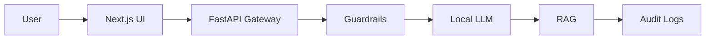
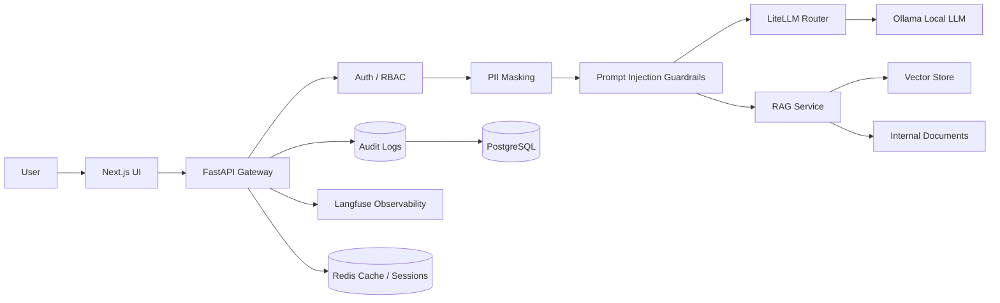
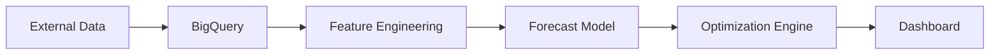
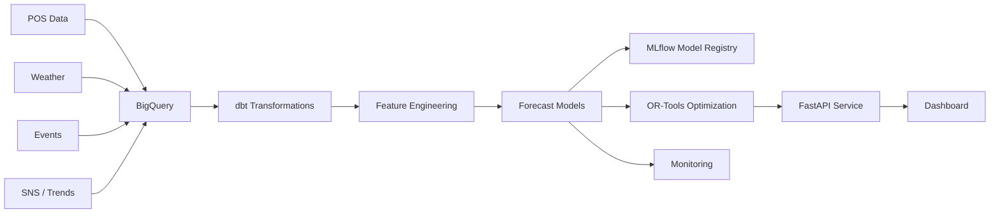
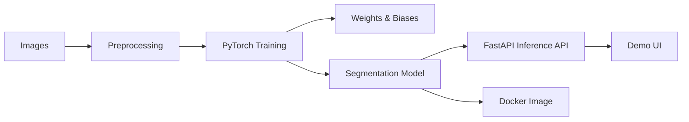
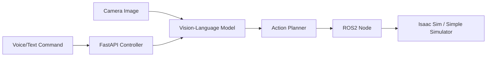

# AI / Enterprise Portfolio Roadmap

This roadmap turns four AI engineering themes into a concrete multi-repository learning plan. The goal is to use Hermes Agent to understand enterprise AI, MLOps, security, system design, vision AI, and Physical AI through hands-on projects.

## Learning Direction

Guiding intent:

> Learn each field by building practical systems with Hermes Agent, then document the design decisions, trade-offs, and limitations clearly.

The projects should not be isolated notebooks. They should be learning artifacts that expose production-aware AI engineering decisions:

- Architecture diagrams.
- Security considerations.
- API and UI layers.
- Dockerized services.
- CI/CD.
- MLOps or observability.
- Clear reasoning: why this design, why these trade-offs.

## Repository Layout

Recommended GitHub organization:

```text
github/
  closed-llm-platform/
  retail-intelligence-platform/
  industrial-vision-ai/
  physical-ai-lab/
  architecture-docs/
```

Alternative: keep each project as a separate repository and use `architecture-docs` as a hub repository linking to all four.

## Priority Order

1. Closed Local LLM Platform
2. Retail Intelligence Platform
3. Industrial Vision AI
4. Physical AI Lab

Reasoning:

- Project 1 is the best starting point for understanding enterprise AI, security, backend/frontend integration, and system design.
- Project 2 maps directly to demand forecasting, optimization, and MLOps requirements.
- Project 3 is the best place to learn PyTorch, Vision, and W&B through an inspectable model pipeline.
- Project 4 is the smallest practical path to understand Physical AI concepts without requiring full robotics hardware.

---

# 1. Closed Local LLM Platform

## Theme

Enterprise Closed LLM Platform

## Goal

Build an internal closed-network AI Agent platform with local LLM inference, RAG, guardrails, PII masking, RBAC, and audit logging.

This is the first project because it is the best hands-on environment for learning enterprise AI system design and security-aware architecture.

## Core Architecture



More production-aware version:



## Required Stack

Must have:

- Ollama
- LangChain
- FastAPI
- Next.js
- Docker

Strong additions:

- LiteLLM
- PostgreSQL
- Redis
- Langfuse
- Vector DB: pgvector, Qdrant, or Chroma

## Must-Have Features

### 1. Prompt Injection Defense

Show enterprise security thinking.

Examples:

- Detect instructions that ask the agent to ignore system policy.
- Separate retrieved document content from system/developer instructions.
- Add allowlisted tool access.
- Add policy checks before and after LLM call.
- Log rejected attempts.

### 2. PII Masking

Banking-like requirement.

Examples:

- Detect emails, phone numbers, account-like numbers, names if possible.
- Mask before sending to the LLM.
- Store raw vs masked data policy clearly.
- Add tests for masking behavior.

### 3. RAG

Internal document search.

Examples:

- Upload or seed internal documents.
- Chunk documents.
- Embed and retrieve.
- Cite source snippets.
- Show grounding in UI.

### 4. Audit Logging

Critical for enterprise AI.

Log:

- user id
- role
- timestamp
- request id
- masked prompt
- retrieved document ids
- model name
- guardrail decision
- response metadata
- latency

### 5. RBAC

Role-based access control.

Example roles:

- admin
- analyst
- employee
- auditor

Demonstrate:

- document-level access filtering
- endpoint permissions
- audit viewer role

## What This Helps You Understand

- LLM engineering
- Enterprise security
- Backend API design
- Frontend UI
- RAG
- Auditability
- Dockerized deployment
- System design

## Suggested Milestones

### M1: Skeleton

- FastAPI API
- Next.js UI
- Docker Compose
- Ollama connection
- Basic chat

### M2: RAG

- document ingestion
- vector store
- source citations
- RAG endpoint

### M3: Security

- prompt injection checks
- PII masking
- RBAC

### M4: Audit and Observability

- PostgreSQL audit logs
- Langfuse traces
- admin/auditor UI

### M5: Polish

- README
- architecture diagram
- threat model
- test suite
- GitHub Actions

---

# 2. Retail Intelligence Platform

## Theme

Demand Forecasting + Optimization Platform

## Goal

Build a retail intelligence system that integrates external data, forecasts demand, and optimizes ordering decisions.

This should look like an MLOps platform, not a notebook.

## Core Architecture



Expanded architecture:



## Stack

- BigQuery
- dbt
- PyTorch
- LightGBM
- Prophet
- OR-Tools
- MLflow
- Docker
- GitHub Actions
- FastAPI or Streamlit/Next.js dashboard

## Must-Have Features

- Data pipeline with sample POS/weather/event data.
- Feature engineering pipeline.
- Forecast model comparison.
- Order optimization using OR-Tools.
- MLflow experiment tracking.
- Dockerized training/inference.
- CI/CD with GitHub Actions.
- Dashboard showing forecast and recommended order quantities.

## What This Helps You Understand

- Demand forecasting
- Mathematical optimization
- Data engineering
- MLOps
- BigQuery/dbt experience
- Docker and CI/CD

## Suggested Milestones

### M1: Data and Baseline

- sample dataset
- BigQuery or local BigQuery-compatible abstraction for demo
- dbt transformations
- baseline forecasting model

### M2: Model Tracking

- MLflow experiment tracking
- compare Prophet / LightGBM / PyTorch baseline

### M3: Optimization

- OR-Tools inventory/order optimization
- constraints: stockout risk, storage, budget, lead time

### M4: Serving and Dashboard

- FastAPI inference endpoint
- dashboard with forecast and order plan

### M5: MLOps Polish

- Docker Compose
- GitHub Actions
- README with training/deployment/monitoring/rollback

---

# 3. Industrial Vision AI

## Theme

Industrial Vision AI

## Goal

Build a practical computer vision system for segmentation or anomaly detection in an industrial setting.

Recommended direction: segmentation.

Why segmentation:

- Strong PyTorch signal.
- Practical manufacturing/inspection relevance.
- Easier to inspect visually.
- Connects well to industrial AI case studies.

## Candidate Use Cases

- Factory defect segmentation.
- Surface crack detection.
- Adhesive application segmentation.
- Packaging anomaly detection.
- Product region segmentation.

## Architecture



## Stack

- PyTorch
- U-Net, SegFormer, or YOLOv11 Seg
- W&B
- FastAPI
- Docker
- OpenCV
- optionally Label Studio for annotation workflow

## Must-Have Features

- Dataset preparation script.
- Training pipeline.
- W&B experiment tracking.
- Inference API.
- Dockerized serving.
- Visual demo: image in, mask overlay out.
- Metrics: IoU, Dice, precision/recall.

## What This Helps You Understand

- PyTorch
- Vision AI
- Industrial AI use case design
- Experiment tracking with W&B
- Model serving
- Docker

## Suggested Milestones

### M1: Dataset and Baseline

- choose public dataset or synthesize a small dataset
- implement U-Net baseline
- train locally

### M2: Experiment Tracking

- integrate W&B
- track metrics and sample predictions

### M3: Inference API

- FastAPI endpoint for image upload
- return mask and overlay

### M4: Docker and Demo

- Dockerfile
- demo UI or notebook-free script
- README with results

### M5: Production Notes

- failure modes
- monitoring strategy
- retraining plan

---

# 4. Physical AI Lab

## Theme

Physical AI Mini Project

## Goal

Demonstrate practical interest in Physical AI by connecting language, vision, and action planning in a small robotics-like loop.

This does not need full robotics hardware. A simulation or simple local demo is enough.

## Example Scenario

User command:

> Find the red bottle.

System flow:

1. Receive voice or text instruction.
2. Capture or load camera image.
3. Use VLM/local model to identify target.
4. Produce action instruction.
5. Send command to ROS2 or simulator.

## Architecture



## Stack

- ROS2
- Ollama or local VLM where feasible
- OpenVLA research notes or mock-compatible interface
- Isaac Sim if feasible
- FastAPI
- Python

## Must-Have Features

- Text command input.
- Image input.
- Object grounding or target selection.
- Action plan output.
- ROS2-compatible command interface, even if simulated.
- Clear README explaining limitations.

## What This Helps You Understand

- Physical AI understanding backed by implementation.
- VLM-to-action architecture thinking.
- Robotics interface awareness.
- Local model experimentation.

## Suggested Milestones

### M1: Minimal VLM Planner

- text instruction
- image input
- target selection
- JSON action plan

### M2: ROS2 Interface

- publish action command
- simple subscriber logs action

### M3: Simulation

- simple 2D grid or Isaac Sim if available
- visualize target/action

### M4: Documentation

- architecture
- limitations
- future work

---

# Cross-Project README Requirements

Every project README should include these sections:

1. Project summary
2. Architecture diagram in Mermaid
3. Why this design?
4. Features
5. Tech stack
6. Quick start
7. Security considerations
8. MLOps / deployment / monitoring notes
9. Testing
10. Limitations
11. Roadmap

## Architecture Diagram

Must be visible near the top.

## Why This Design?

Explain trade-offs, not just tools.

Examples:

- Why closed local LLM instead of external API?
- Why FastAPI as gateway?
- Why PostgreSQL for audit logs?
- Why MLflow vs just saving model files?
- Why OR-Tools for optimization?

## Security Considerations

Include where relevant:

- prompt injection
- data leakage
- hallucination
- permission boundaries
- PII handling
- audit logging
- RBAC
- model supply chain risk

## MLOps Considerations

Include where relevant:

- training
- evaluation
- deployment
- monitoring
- rollback
- model registry
- experiment tracking

---

# Skill Gap Plan

Existing strengths:

- BigQuery
- data platforms
- demand forecasting
- OR-Tools
- Web / Next.js
- AI Agent concepts
- MCP
- n8n

Highest priority additions:

1. PyTorch
2. Docker
3. MLflow / W&B
4. FastAPI
5. CI/CD with GitHub Actions

## Practical Learning Order

1. FastAPI + Docker through Closed LLM Platform skeleton.
2. MLflow through Retail Intelligence Platform.
3. PyTorch + W&B through Industrial Vision AI.
4. ROS2/VLM through Physical AI Lab.

---

# Recommended Execution Strategy

Do not build all four at once.

Use a portfolio pipeline:

1. Create repository skeleton for all four projects.
2. Fully build Project 1 to a polished MVP.
3. Build Project 2 to a polished MVP.
4. Build Project 3 as a focused, visual demo.
5. Build Project 4 as a small but credible lab prototype.
6. Create `architecture-docs` as a hub linking the four projects.

## First 30 Days

### Week 1

- Create repo skeletons.
- Write high-quality README drafts.
- Implement Closed LLM Platform skeleton: Next.js + FastAPI + Docker Compose + Ollama.

### Week 2

- Add RAG.
- Add prompt injection checks.
- Add PII masking.

### Week 3

- Add RBAC and audit logging.
- Add Langfuse or structured observability.
- Polish README and architecture docs.

### Week 4

- Start Retail Intelligence Platform.
- Build data pipeline and baseline forecast.
- Add MLflow tracking.

## Portfolio Quality Bar

A project is ready to publish or share when:

- It runs from README instructions.
- It has an architecture diagram.
- It explains why the design was chosen.
- It has Docker support.
- It has tests or at least verifiable demo scripts.
- It discusses security or MLOps where relevant.
- It has screenshots or sample outputs.
- It has a clear limitations section.
