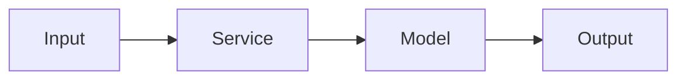

# Portfolio Project README Template

Use this template for each portfolio repository.

```markdown
# [Project Name]

One-sentence summary of the project.

## Why This Project Matters

Explain the business or engineering problem.

Example:

> This project demonstrates how to design a closed-network enterprise LLM platform with local inference, RAG, RBAC, PII masking, prompt injection defenses, and audit logging.

## Architecture



## Why This Design?

Explain the major design decisions.

- Why this architecture?
- Why this model or framework?
- Why this database or storage layer?
- What trade-offs were made?
- What would change in production?

## Features

- Feature 1.
- Feature 2.
- Feature 3.

## Tech Stack

- Backend:
- Frontend:
- ML/AI:
- Data:
- Infra:
- Observability:

## Quick Start

```bash
# clone
# configure
# run
```

## Demo

Add screenshots, GIFs, sample requests, or sample outputs.

## API

Document important endpoints.

| Method | Path | Description |
|--------|------|-------------|
| GET | `/health` | Health check |
| POST | `/...` | ... |

## Security Considerations

Discuss relevant issues:

- Prompt injection.
- Data leakage.
- PII handling.
- RBAC.
- Audit logging.
- Permission boundaries.
- Model hallucination.
- Supply chain risk.

## MLOps / Operations

Discuss where relevant:

- Training pipeline.
- Evaluation.
- Model registry.
- Deployment.
- Monitoring.
- Rollback.
- CI/CD.

## Testing

```bash
# test commands
```

## Project Structure

```text
.
  src/
  tests/
  docs/
  docker-compose.yml
  README.md
```

## Limitations

Be honest about what this project does not solve.

- Limitation 1.
- Limitation 2.

## Roadmap

- [ ] Next improvement 1.
- [ ] Next improvement 2.
- [ ] Next improvement 3.

## References

- [Reference](URL)
```
